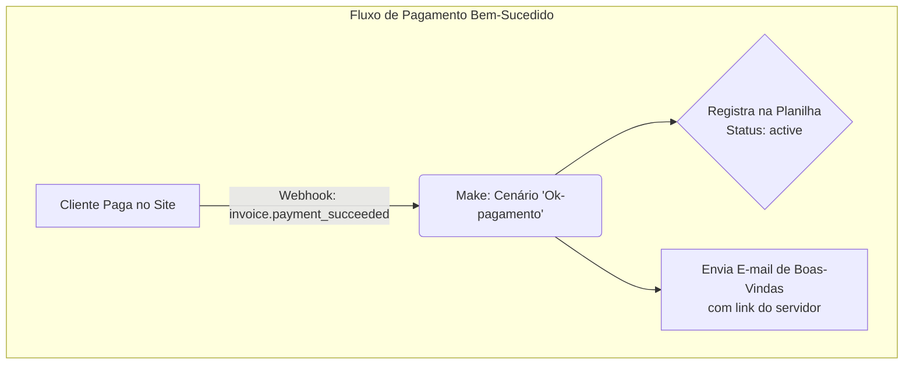
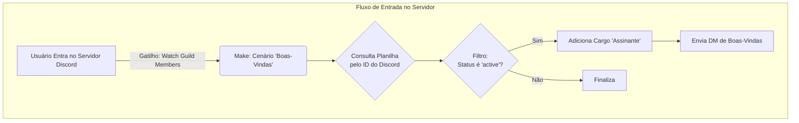
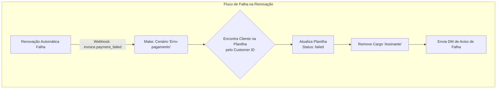

# 🚀 Sistema de Automação de Assinaturas para Comunidades Discord 🚀

Um sistema robusto e totalmente automatizado para gestão do ciclo de vida de assinantes em uma comunidade Discord, com frontend hospedado na Vercel e orquestração de backend via **Stripe**, **Node.js** e **Make.com**.

**Link para a Aplicação ao Vivo:** [**https://rpg-teste.vercel.app/**](https://rpg-teste.vercel.app/)

---

### ✨ Demonstração Visual do Fluxo

O sistema opera com uma arquitetura de micro-serviços orientada a eventos, onde cada cenário de automação age como um especialista independente, orquestrado por uma fonte de dados central (Google Sheets).

### 💡 Sobre o Projeto
Este projeto automatiza a gestão completa de membros pagantes em uma comunidade do Discord. Ele lida com o ciclo de vida de um assinante, da aquisição e concessão de acesso ao tratamento de falhas de pagamento e revogação de acesso, tudo de forma 100% autônoma.

### 🧪 Como Testar a Aplicação ao Vivo
O projeto está hospedado e pode ser testado diretamente pelo navegador. Para isso, você precisará de uma conta do Discord e dos cartões de teste do Stripe.

#### Cenário 1: Pagamento Bem-Sucedido (O "Caminho Feliz")
1.  **Acesse a aplicação:** https://rpg-teste.vercel.app/
2.  Clique em "**Conectar com o Discord**" e autorize o aplicativo.
3.  Clique em "**Assinar Agora**".
4.  Na página de pagamento do Stripe, utilize o seguinte cartão de teste para **pagamentos aprovados**:
    - **Número:** `4242 4242 4242 4242`
    - **Validade/CVC:** Qualquer data futura e CVC de 3 dígitos (ex: `12/30` e `123`).

**Resultado Esperado:** O pagamento será aprovado. Nos bastidores, o cenário `Ok-pagamento` irá:
- Adicionar uma nova linha na planilha de controle com status `active`.
- Enviar um e-mail com o link de convite para o servidor do Discord.
- Ao entrar no servidor usando o link, o cenário `Boas-Vindas` será acionado (pode levar alguns minutos), concedendo o cargo "Assinante" ao usuário e enviando uma DM de boas-vindas.

#### Cenário 2: Falha no Pagamento (Dois Tipos de Falha)
Existem duas formas de falha de pagamento, e o sistema lida com elas de maneiras diferentes:

##### A) Falha na Criação da Assinatura (Teste via Interface)
Este teste demonstra o que acontece quando um novo cliente tenta pagar com um cartão inválido.
1. Siga os passos 1 a 3 do cenário anterior.
2. Na página de pagamento do Stripe, utilize o seguinte cartão de teste para **pagamentos recusados**:
    - **Número:** `4000 0000 0000 0000`
    - **Validade/CVC:** Qualquer data futura e CVC de 3 dígitos (ex: `12/30` e `123`).

**Resultado Esperado:** O Stripe exibirá uma mensagem de erro na própria página ("Seu cartão foi recusado."). A assinatura não é criada, e portanto, nosso cenário `Erro-pagamento` **corretamente não é acionado**, pois não há uma assinatura existente para tratar.

##### B) Falha na Renovação da Assinatura (Cenário `Erro-pagamento`)
Este é o cenário para o qual a automação `Erro-pagamento` foi construída, tratando de um cliente **já existente** cuja renovação automática falha.

-   **Como funciona:** Quando a renovação falha, o Stripe envia um webhook `invoice.payment_failed`. O cenário `Erro-pagamento` é acionado e executa as seguintes ações:
    - Encontra o cliente na planilha.
    - Atualiza o status da assinatura para `failed`.
    - Remove o cargo "Assinante" no Discord.
    - Envia uma DM de aviso ao usuário.
-   **Como foi testado:** Este fluxo não pode ser simulado pela interface de um novo cliente. Sua validação foi feita durante o desenvolvimento, utilizando as ferramentas do Stripe para enviar um evento de teste `invoice.payment_failed`, confirmando o funcionamento de toda a automação.

### 💻 Stack de Tecnologias

| Tecnologia | Função |
|---|---|
| **Node.js + Express** | Backend para autenticação e criação de sessões de checkout. |
| **Vercel** | Plataforma de hospedagem para deploy do servidor Node.js. |
| **Stripe** | Gateway de pagamento e fonte de eventos (webhooks). |
| **Make.com** | Cérebro da automação, orquestrando as ações. |
| **Discord** | Plataforma da comunidade (gestão de cargos e DMs). |
| **Google Sheets** | Banco de dados e log de auditoria. |

---

### 📜 Licença
Distribuído sob a Licença MIT.
