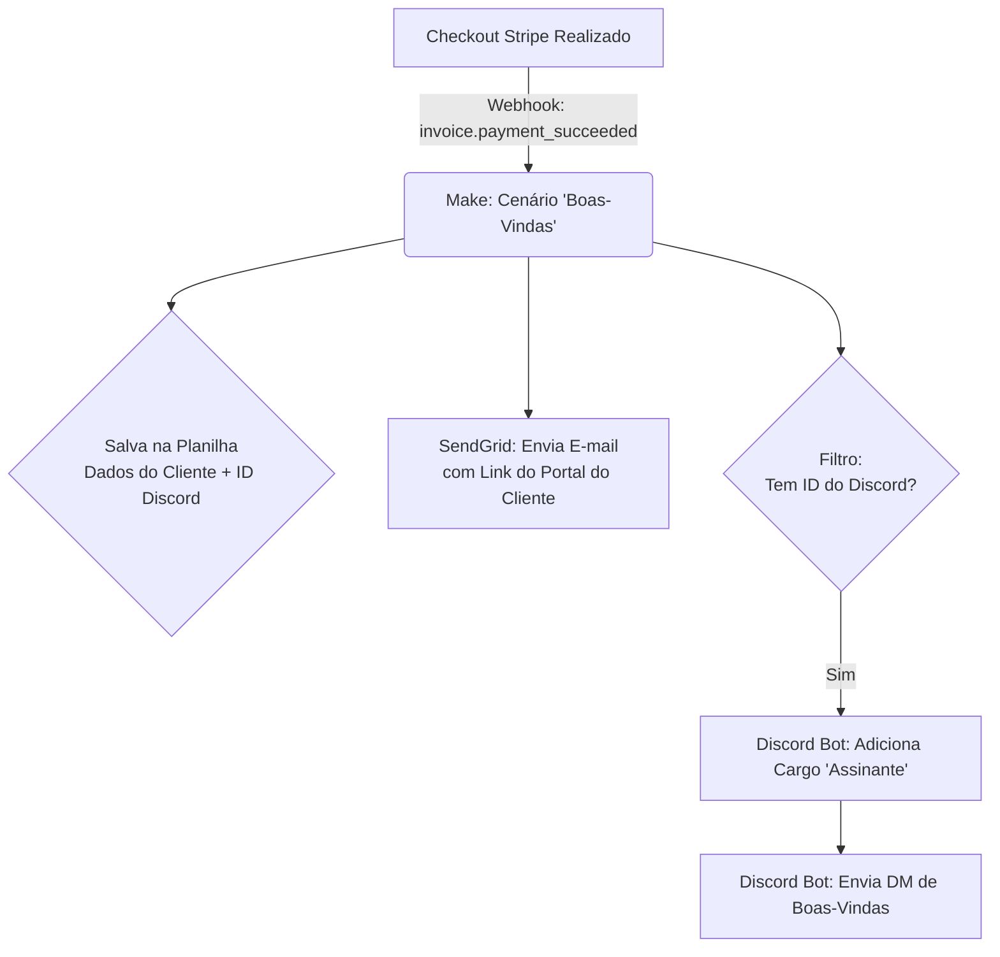
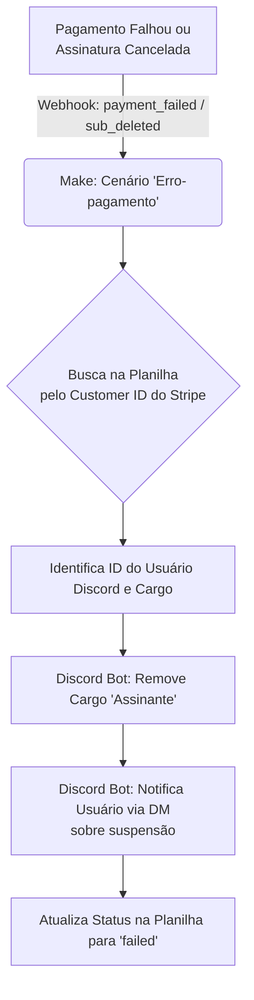

# 🏰 Mestres de Aluguel RPG - O Portal da Guilda

> **"Forje sua lenda, garanta seu lugar."**

Uma plataforma imersiva e automatizada para gestão de assinaturas de mesas de RPG. O sistema integra pagamentos, autenticação social e gestão de comunidade, permitindo que Mestres foquem na narrativa enquanto a tecnologia cuida da burocracia.

🌐 **Acesse a Guilda:** [**mestresdealuguelrpg.vercel.app**](https://mestresdealuguelrpg.vercel.app/)

---

## ⚔️ Sobre o Projeto

Este projeto não é apenas uma landing page; é um sistema completo de **Memberstack** feito sob medida para RPGs. Ele gerencia o ciclo de vida completo do aventureiro (cliente):

1.  **Identificação:** Login social via Discord OAuth2.
2.  **Contrato:** Checkout seguro via Stripe (Assinatura Recorrente).
3.  **Iniciação:** Convite automático e atribuição de cargos no servidor Discord.
4.  **Manutenção:** Gestão automática de falhas de pagamento e cancelamentos (expulsão/remoção de cargos).

---

## 🛠️ O Arsenal Tecnológico (Stack)

A aplicação segue uma arquitetura orientada a eventos, onde o servidor Node.js atua como iniciador e o Make.com como orquestrador lógico.

| Tecnologia | Ícone | Função no Reino |
| :--- | :---: | :--- |
| **Node.js + Express** | 🟢 | Backend que gerencia rotas, OAuth2 do Discord e Sessões do Stripe. |
| **Frontend (HTML/JS)** | 🎨 | Interface "Dark Fantasy" imersiva com feedback visual dinâmico. |
| **Stripe (Live Mode)** | 💳 | Gateway de pagamentos, gestão de assinaturas e Webhooks. |
| **Make (Integromat)** | 🟣 | Cérebro da automação (ETL), conectando Stripe, Google Sheets e Discord. |
| **Discord Bot** | 🤖 | Agente que entrega cargos, envia DMs e gerencia permissões. |
| **SendGrid** | 📧 | Serviço profissional de entrega de pergaminhos (e-mails) transacionais. |
| **Google Sheets** | 📊 | Banco de dados relacional simplificado para logs e auditoria. |

---

## ✨ Fluxos de Automação (Arquitetura)

O sistema "pensa" sozinho através de cenários complexos no Make. Abaixo está a lógica visual dos processos:

### 1. O Caminho da Glória (Pagamento Aprovado)
Quando um aventureiro firma o contrato, o sistema garante sua entrada imediata.

### 2. A Maldição da Inadimplência (falha/Cancelamento)
O sistema protege a guilda removendo automaticamente quem quebra o contrato.

---
### 🚀 Diferenciais do Sistema
1. **Identidade Visual Imersiva:** Design "Dark Fantasy" com tipografia Cinzel e paleta dourada.
2. **Segurança Anti-Fraude:** Validação rigorosa de client_reference_id para garantir a entrega do produto digital.
3. **Tratamento de Erros:** Feedback visual no Frontend para evitar falhas silenciosas durante o checkout.
4. **Portal do Assinante:** Self-service para o cliente gerenciar cartões e faturas sem intervenção humana.
5. **Confirmação Dinâmica:** Páginas de sucesso personalizadas baseadas no produto adquirido.

### 🛡️ Direitos e Licença
**© 2025 Mestres de Aluguel RPG. Todos os direitos reservados.**

Este código é proprietário. O uso, cópia, modificação ou distribuição não autorizada deste software, no todo ou em parte, é estritamente proibido.

Este repositório serve apenas para fins de demonstração de portfólio e capacidade técnica.

 Feito com ⚔️ e ☕ por <a href="https://www.google.com/search?q=https://github.com/mariana-kleina">Mariana Kleina</a> 

